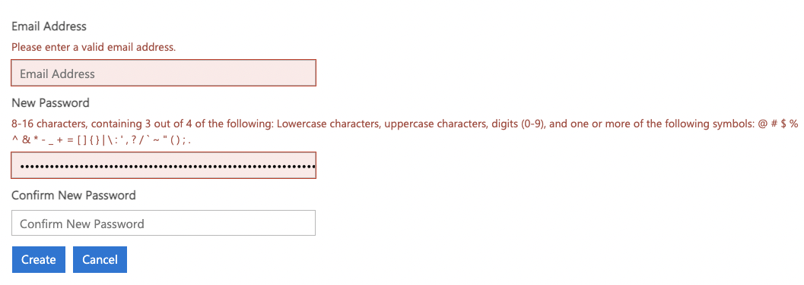

# cuddly-succotash
Generate passwords locally

### Usage

Set parameters in `config.ini` based on password requirements.

**Configuration parameters**:
```
min           (int) Minimum length of password
numeric       (int) Number of numeric characters
upper         (int) Number of uppercase characters
lower         (int) Number of lowercase characters
special       (int) Number of special characters
special_chars (int) Number of special characters
```

**Basic usage**

Example from Microsoft



```
[DEFAULT]
min = 16
numeric = 2
upper = 2
lower = 2
special = 3
special_chars =
```

Run `python pwd-gen.py -c config`

Example output:
```
16-length pwd:

Tw?E,5c6NKU/&pav
```

To generate a password without characters constraints, leave all the character fields empty:

```
[DEFAULT]
min = 64
numeric =
upper =
lower =
special =
special_chars =
```

Example output:
```
64-length pwd:

WiZF3p!Bc~1HY&PE;6^L9<shIXlN>{s7Sh*Pn`}cstE">l8tLI$iW5RA4IM.vTvQ
```

**Specific special characters**

Add specific special characters that can be used as a single string without spaces or seperators. If not special characters are 
specified, the punctuation characters from Python's string library will be used by default.

```
[DEFAULT]
min = 16
numeric = 2
upper = 2
lower = 2
special = 3
special_chars = !$
```